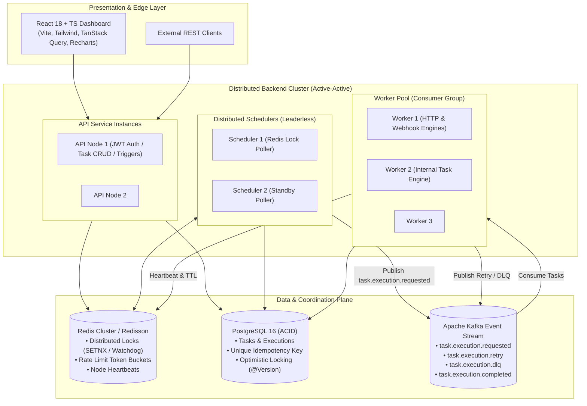

# Distributed Task Scheduler (DTS)

[](https://www.oracle.com/java/)
[](https://spring.io/projects/spring-boot)
[](https://kafka.apache.org/)
[](https://www.postgresql.org/)
[](https://redis.io/)
[](https://react.dev/)
[](https://www.typescriptlang.org/)
[](https://www.docker.com/)

* **GitHub Repository**: [https://github.com/akashwork9/distributed-task-scheduler](https://github.com/akashwork9/distributed-task-scheduler)
* **Live Public Demo**: [https://sub-immediate-city-faqs.trycloudflare.com](https://sub-immediate-city-faqs.trycloudflare.com)
* **Local Web Console**: [http://localhost:5173](http://localhost:5173) (Pre-seeded demo credentials: `demo@example.com` / `password123`)
* **Local REST API / Health**: [http://localhost:8080/actuator/health](http://localhost:8080/actuator/health)
* **Interactive Swagger UI**: [http://localhost:8080/swagger-ui/index.html](http://localhost:8080/swagger-ui/index.html)

### One-Click Cloud Deployments

| Component | 1-Click Deploy Action | Target Service |
| :--- | :--- | :--- |
| **Frontend UI** | [](https://vercel.com/new/clone?repository-url=https%3A%2F%2Fgithub.com%2Fakashwork9%2Fdistributed-task-scheduler&root-directory=frontend&env=VITE_API_URL&envDescription=Backend%20API%20Endpoint%20URL&project-name=distributed-task-scheduler-ui) | **Vercel** (Global Edge CDN) |
| **Backend API & Workers** | [](https://render.com/deploy?repo=https://github.com/akashwork9/distributed-task-scheduler) | **Render** (Docker Container Service) |
| **Full Stack Monorepo** | [](https://railway.com/new/template?template=https%3A%2F%2Fgithub.com%2Fakashwork9%2Fdistributed-task-scheduler) | **Railway** (Postgres + Redis + API) |

A production-grade, horizontally scalable, event-driven distributed task and job scheduling platform engineered in **Java 21/25, Spring Boot 3, Apache Kafka, Redis, and PostgreSQL**, coupled with a **React 18 + TypeScript + Tailwind CSS** cloud control plane.

---

## 1. System Architecture



---

## 2. Core Distributed Systems Capabilities

* **Dynamic Scheduling Semantics**:
  * `ONE_TIME`: Executes at a specific scheduled timestamp.
  * `INTERVAL`: Repeats on fixed intervals (e.g., every 60s).
  * `CRON`: Standard 5- and 6-field UNIX/Quartz cron expressions with IANA timezone evaluation.
* **Leaderless Distributed Scheduling**:
  * Schedulers coordinate via Redisson distributed locking (`lock:scheduler:poll`). Exactly one instance scans and dispatches per cycle; standby schedulers yield without lock contention.
* **At-Least-Once Messaging to Effective Exactly-Once Execution**:
  * Kafka guarantees message delivery across consumer rebalances.
  * Upstream scheduler generates unique `execution_id` enforced by a database `UNIQUE` constraint.
  * Workers execute atomic conditional state updates (`WHERE execution_id = :id AND status = 'QUEUED'`), guaranteeing strict execution idempotency and discarding duplicate deliveries.
* **Resilient Retry Lifecycle with Exponential Backoff & DLQ**:
  * Failed executions retry with exponential delay: $\min(\text{delay} \times \text{multiplier}^{\text{attempt}-1}, \text{maxDelay})$.
  * Exhausted retries automatically route to `task.execution.dlq` for inspection and one-click manual retry.
* **Worker Liveness & Zombie Recovery**:
  * Workers emit heartbeats every 10s.
  * A watchdog recovery daemon detects abandoned or stuck jobs from crashed worker nodes and resurrects them for retry.
* **SSRF Protection**:
  * Outbound `HTTP_TASK` and `WEBHOOK_TASK` invocations validate DNS resolutions against loopback, cloud metadata endpoints (`169.254.169.254`), and private RFC 1918 subnets.
* **Optimistic Locking**:
  * All entities utilize JPA `@Version` to protect against lost-update anomalies during concurrent modifications.

---

## 3. Quick Start with Docker Compose

Run the entire distributed system (Postgres, Redis, Kafka, Backend, Frontend, Prometheus, Grafana) with a single command:

```bash
# Clone the repository
git clone https://github.com/your-username/distributed-task-scheduler.git
cd distributed-task-scheduler/infrastructure

# Launch the cluster
docker compose up -d

# Scale schedulers and workers horizontally (demonstrates distributed coordination)
docker compose up -d --scale backend=3
```

### Access URLs
| Service | URL | Credentials |
| :--- | :--- | :--- |
| **Web Console** | [http://localhost:3000](http://localhost:3000) | `demo@example.com` / `password123` |
| **Admin Console** | [http://localhost:3000](http://localhost:3000) | `admin@example.com` / `admin123` |
| **Swagger API UI** | [http://localhost:8080/swagger-ui/index.html](http://localhost:8080/swagger-ui/index.html) | Bearer JWT Auth |
| **Prometheus Metrics**| [http://localhost:9090](http://localhost:9090) | No auth |
| **Grafana Dashboard** | [http://localhost:3001](http://localhost:3001) | `admin` / `admin` |

---

## 4. Local Development Setup

### Backend (Spring Boot 3)
```bash
cd backend
mvn clean compile
mvn test
mvn spring-boot:run
```

### Frontend (React + Vite + TypeScript)
```bash
cd frontend
npm install
npm run dev
# Opens at http://localhost:5173
```

---

## 5. Architectural Deep Dives
* [Architecture & System Design](file:///Users/akashkumar/Developer/Projects/distributed-task-scheduler/docs/architecture.md)
* [Database Schema & Query Optimization](file:///Users/akashkumar/Developer/Projects/distributed-task-scheduler/docs/database-design.md)
* [Kafka Event-Driven Architecture](file:///Users/akashkumar/Developer/Projects/distributed-task-scheduler/docs/kafka-design.md)
* [Redis Distributed Locking & Rate Limiting](file:///Users/akashkumar/Developer/Projects/distributed-task-scheduler/docs/redis-design.md)
* [Failure Handling & Fault Recovery](file:///Users/akashkumar/Developer/Projects/distributed-task-scheduler/docs/failure-handling.md)
* [Security & SSRF Hardening](file:///Users/akashkumar/Developer/Projects/distributed-task-scheduler/docs/security.md)
* [Horizontal Scalability](file:///Users/akashkumar/Developer/Projects/distributed-task-scheduler/docs/scalability.md)
* [Observability & Structured Logging](file:///Users/akashkumar/Developer/Projects/distributed-task-scheduler/docs/observability.md)
* [Production Deployment](file:///Users/akashkumar/Developer/Projects/distributed-task-scheduler/docs/deployment.md)
* [Interview Preparation Guide](file:///Users/akashkumar/Developer/Projects/distributed-task-scheduler/docs/interview-preparation.md)

---

## 6. License
Licensed under the [Apache License 2.0](LICENSE).
