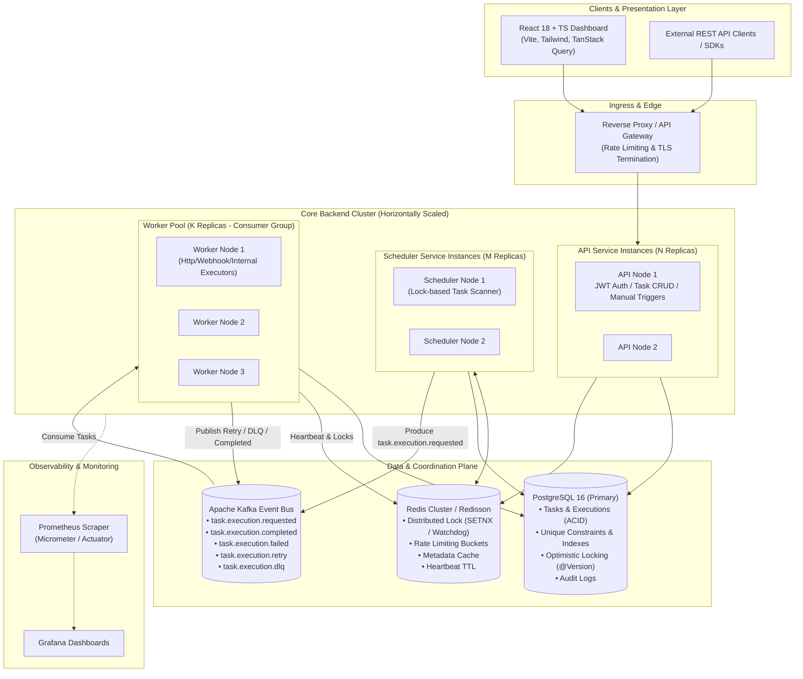
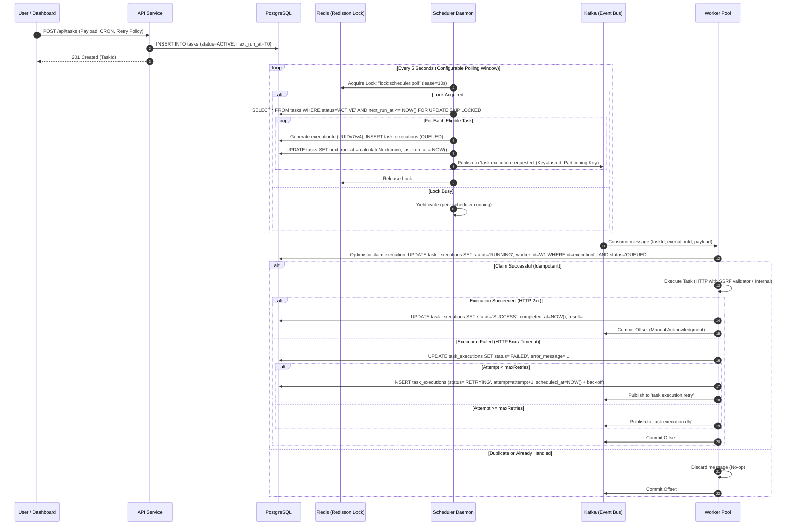
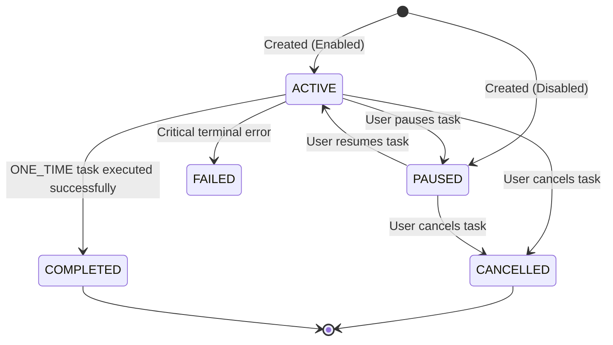
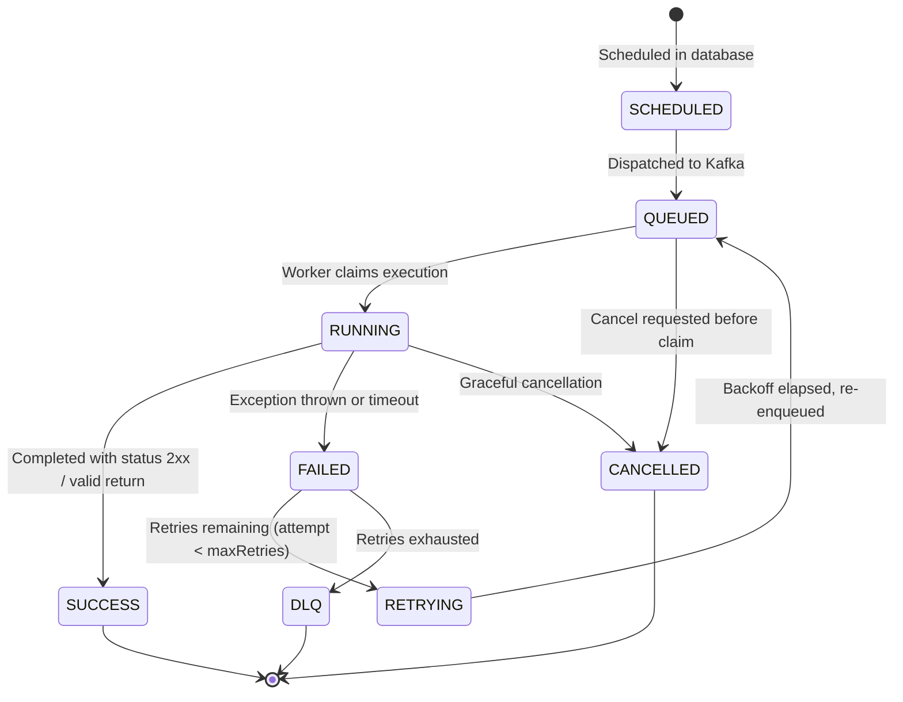

# High-Level Architecture & System Design Specification
## Distributed Task Scheduler (DTS)

---

## 1. System Overview & Problem Statement

Distributed Task Scheduler (DTS) is a horizontally scalable, fault-tolerant, event-driven background job orchestration platform built on **Java 21/25 (Spring Boot 3.3+)**, **Apache Kafka**, **Redis**, and **PostgreSQL**, with a **React + TypeScript + Vite + Tailwind CSS** developer dashboard.

### Core Objectives
1. **Dynamic Task Scheduling**: Support `ONE_TIME`, `INTERVAL`, and `CRON` schedules with IANA timezone support.
2. **Distributed Leaderless Scheduling**: Multiple scheduler replicas run concurrently; Redis distributed locks prevent duplicate task polling and enqueueing.
3. **Decoupled Execution Pipeline**: Kafka partitions task dispatching across dynamic worker consumer groups.
4. **Guaranteed Execution Semantics**: At-least-once message delivery coupled with database-level execution deduplication (`executionId` UNIQUE) delivers strict effective **exactly-once execution**.
5. **Configurable Retry & DLQ Lifecycle**: Truncated exponential backoff with jitter and automated Dead-Letter Queue (DLQ) publishing.
6. **Worker Liveness & Zombie Recovery**: Heartbeat tracking via Redis/Postgres with automated reaper daemon to recover abandoned jobs.
7. **SSRF Hardened**: Safe execution of `HTTP_TASK` and `WEBHOOK_TASK` with private IP/loopback blocking.

---

## 2. High-Level Architecture Diagram



---

## 3. End-to-End Execution Sequence Flow



---

## 4. State Machines

### 4.1 Task Lifecycle State Machine


### 4.2 TaskExecution Lifecycle State Machine


---

## 5. Distributed Systems Guarantees & Strategies

### 5.1 Idempotency Guarantee Matrix
* **Problem**: In distributed messaging systems (Kafka), network hiccups, consumer rebalances, or worker crashes cause message redelivery (**At-Least-Once** delivery).
* **Solution**: 
  1. Unique business execution identifier (`executionId` generated upstream by scheduler).
  2. Database unique constraint: `UNIQUE (execution_id)`.
  3. Worker conditional state update: `UPDATE task_executions SET status='RUNNING' WHERE execution_id = :execId AND status = 'QUEUED'`.
  4. If zero rows updated, the execution has already been claimed or processed; worker acknowledges and safely discards duplicate.

### 5.2 Concurrency Policy
* `ALLOW_CONCURRENT`: New scheduled executions start even if previous instance is still in `RUNNING` status.
* `FORBID_CONCURRENT`: Scheduler checks if any execution for this `taskId` is currently `RUNNING` or `QUEUED`. If so, skip current cycle, record audit log, and advance `next_run_at`.

### 5.3 Distributed Locking Protocol
* Implementation: **Redisson Distributed Lock** or Redis `SET resource_name my_random_value NX PX 30000`.
* Lock Lease & Watchdog: Default lease of 10s with background watchdog thread renewing TTL until transaction completes, preventing indefinite lock retention upon JVM sudden kill (`SIGKILL`).

---

## 6. Detailed Repository Directory Structure

```text
distributed-task-scheduler/
├── backend/
│   ├── pom.xml
│   ├── Dockerfile
│   └── src/
│       ├── main/
│       │   ├── java/com/dts/scheduler/
│       │   │   ├── Application.java
│       │   │   ├── config/             # Spring, Kafka, Redis, Security, OpenAPI configs
│       │   │   ├── security/           # JWT filter, UserDetailsService, SecurityContext
│       │   │   ├── controller/         # REST Controllers (Auth, Task, Execution, Worker, Metrics)
│       │   │   ├── service/            # Core business logic services & interfaces
│       │   │   ├── repository/         # Spring Data JPA repositories with query methods
│       │   │   ├── entity/             # JPA entity definitions with @Version, indexes
│       │   │   ├── dto/                # Request & Response Data Transfer Objects
│       │   │   ├── mapper/             # Entity-DTO mapping
│       │   │   ├── scheduler/          # Scheduler poller, CRON evaluator, lock orchestrator
│       │   │   ├── worker/             # Task execution engine, executor factory (HTTP, Webhook, Internal)
│       │   │   ├── kafka/              # Kafka producers, consumers, serializers, retry/DLQ handlers
│       │   │   ├── redis/              # Distributed lock helper, rate limiter, cache keys
│       │   │   ├── exception/          # GlobalExceptionHandler, Custom Domain Exceptions
│       │   │   ├── validation/         # SSRF validator, CronValidator, URLValidator
│       │   │   ├── metrics/            # Micrometer meter registry custom metrics
│       │   │   └── audit/              # Audit logging aspect and event listener
│       │   └── resources/
│       │       ├── application.yml
│       │       ├── application-dev.yml
│       │       ├── application-prod.yml
│       │       └── db/migration/       # Flyway V1..V6 SQL migration scripts
│       └── test/
│           ├── java/com/dts/scheduler/ # Unit & Testcontainers Integration tests
│           └── resources/
├── frontend/
│   ├── package.json
│   ├── tsconfig.json
│   ├── vite.config.ts
│   ├── tailwind.config.js
│   ├── Dockerfile
│   └── src/
│       ├── components/         # Reusable UI elements (Navbar, Sidebar, Badges, Modals, Timeline)
│       ├── pages/              # Dashboard, TaskList, TaskCreate, TaskDetail, Executions, Workers, Metrics
│       ├── services/           # Axios API client, query hooks, auth store
│       ├── types/              # TypeScript interfaces mirroring backend DTOs
│       └── utils/              # Formatters, cron humanizers, date helpers
├── infrastructure/
│   ├── docker-compose.yml      # Multi-container orchestration (App, Postgres, Redis, Kafka, Prometheus, Grafana)
│   ├── prometheus/
│   │   └── prometheus.yml
│   └── grafana/
│       ├── provisioning/
│       └── dashboards/
│           └── dts-metrics.json
├── docs/                       # Comprehensive architecture, database, kafka, security & interview specs
├── .github/
│   └── workflows/
│       └── ci-cd.yml           # GitHub Actions pipeline
├── .env.example
├── README.md
└── LICENSE
```
