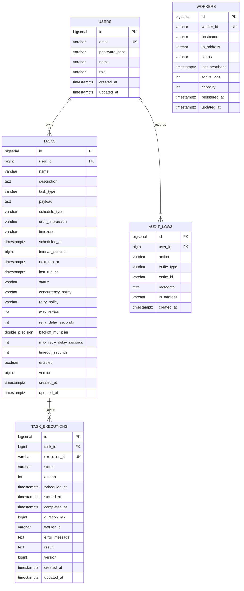

# Database Design Specification

---

## 1. Relational Model & Entity Relationships

The Distributed Task Scheduler database is designed for PostgreSQL 15+ using strong relational integrity, primary keys (`BIGSERIAL`), foreign keys with explicit cascade/set-null policies, unique constraints for idempotency, and compound B-tree indexes optimized for the high-frequency polling queries.



---

## 2. Table Indexing & Query Optimization Rationale

### 2.1 The Critical Poller Index
```sql
CREATE INDEX idx_tasks_schedule_poll ON tasks (status, enabled, next_run_at);
```
* **Query Pattern**:
  ```sql
  SELECT * FROM tasks
  WHERE status = 'ACTIVE' AND enabled = true AND next_run_at <= :now
  ORDER BY next_run_at ASC
  LIMIT :batchSize
  FOR UPDATE SKIP LOCKED;
  ```
* **Performance Impact**: An index scan across `(status, enabled, next_run_at)` avoids expensive table sequential scans even when `tasks` contains millions of records.
* **Row-Level Concurrency**: `FOR UPDATE SKIP LOCKED` allows parallel scheduler threads to pick distinct batches without lock contention.

### 2.2 Execution Deduplication Index
```sql
CONSTRAINT uk_task_executions_execution_id UNIQUE (execution_id);
```
* Guarantees at the storage engine level that duplicate Kafka deliveries cannot create redundant execution records.
* Allows optimistic claiming:
  ```sql
  UPDATE task_executions
  SET status = 'RUNNING', started_at = CURRENT_TIMESTAMP, worker_id = :workerId
  WHERE execution_id = :executionId AND status = 'QUEUED';
  ```

### 2.3 Optimistic Locking (`version` Column)
* Both `tasks` and `task_executions` include `version BIGINT NOT NULL DEFAULT 0`.
* Annotated with `@Version` in Spring Data JPA.
* Eliminates the lost-update anomaly if an API user modifies task parameters concurrently with the scheduler advancing `next_run_at`.
