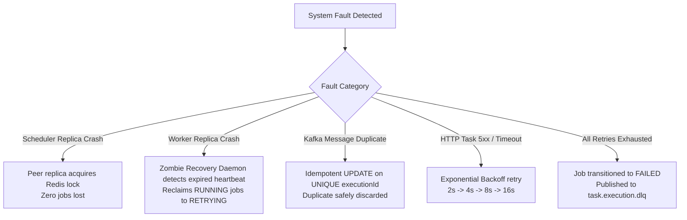

# Distributed Failure Handling & Fault Recovery Guide

---

## 1. Failure Scenarios & Mitigation Strategies



### Scenario 1: Scheduler Instance Sudden Crash
* **Mechanism**: If Scheduler-1 crashes while holding `lock:scheduler:poll`, the lock automatically expires after the 10-second lease TTL.
* **Resolution**: Scheduler-2 acquires the lock on the subsequent cycle. Tasks stored in PostgreSQL with `next_run_at <= NOW()` are picked up and dispatched. No scheduled tasks are permanently dropped.

### Scenario 2: Worker Instance Crash Mid-Execution
* **Problem**: Worker-1 pulls a task, marks it `RUNNING`, but crashes before completing the external HTTP call or updating the database.
* **Resolution**: `ZombieTaskRecoveryDaemon` scans every 30 seconds for executions remaining in `RUNNING` status beyond `timeoutSeconds + 60s` or whose assigned worker heartbeat has expired. It transitions the task to `RETRYING` (or `FAILED` if retries exhausted) and re-dispatches to Kafka.

### Scenario 3: Kafka Delivers the Same Message Twice
* **Cause**: Network timeout during consumer offset commit.
* **Resolution**: Worker executes:
  ```sql
  UPDATE task_executions 
  SET status = 'RUNNING', started_at = NOW(), worker_id = :workerId
  WHERE execution_id = :executionId AND status = 'QUEUED';
  ```
  If 0 rows are affected (already claimed or terminal), the worker detects the duplication, logs an informational skip, and commits offset immediately without redundant re-execution.

### Scenario 4: External HTTP Target Returns 5xx or Times Out
* **Resolution**: The `HttpTaskExecutor` catches the exception or evaluates non-2xx status code. It increments the attempt count and computes exponential backoff:
  $$\text{Delay} = \min(\text{retryDelaySeconds} \times \text{backoffMultiplier}^{\text{attempt}-1}, \text{maxRetryDelaySeconds})$$
  The task is published to `task.execution.retry`.

### Scenario 5: Retries Exhausted (Dead Letter Queue)
* **Resolution**: When `attempt >= maxRetries`, the execution is marked `FAILED` with a detailed error stack trace, and published to `task.execution.dlq`.
* **Remediation**: The DTS Dashboard alerts administrators and enables one-click manual retry (`POST /api/executions/{id}/retry`) once downstream dependencies recover.

### Scenario 6: Redis Cluster Temporarily Unavailable
* **Resolution**: The scheduler fails safe. Even without Redis coarse locks, the PostgreSQL poller uses transactional row-level locks:
  ```sql
  SELECT * FROM tasks WHERE status = 'ACTIVE' AND next_run_at <= NOW()
  FOR UPDATE SKIP LOCKED;
  ```
  This guarantees that even with Redis down, multiple schedulers will never claim the exact same task row simultaneously.

### Scenario 7: Concurrent Scheduling Collision
* **Resolution**: Two schedulers attempting to process the same task simultaneously will be resolved by the distributed lock tier; if both bypass the lock during a split-brain, PostgreSQL's `FOR UPDATE SKIP LOCKED` partitions the rows cleanly.
