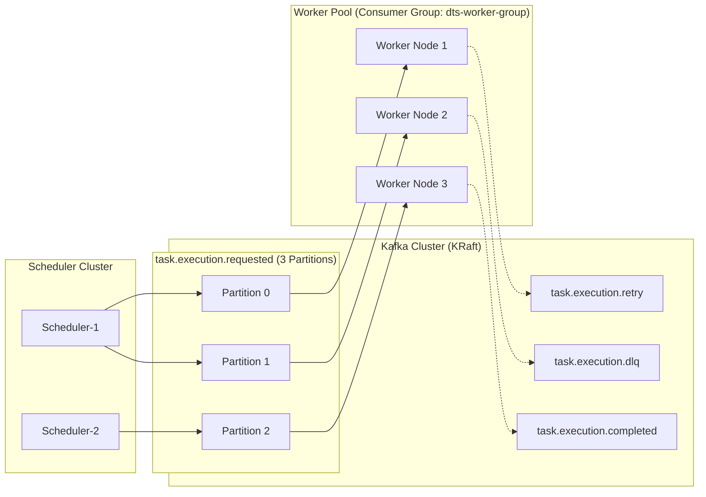

# Apache Kafka Event-Driven Architecture & Delivery Semantics

---

## 1. Why Kafka Instead of Direct In-Memory or REST Invocations?
Direct invocation between a scheduler and worker fleet creates tight coupling, synchronous blocking, and failure vulnerability:
* **Decoupling**: Schedulers produce execution intent events without knowing which worker instance will execute them.
* **Buffering & Backpressure**: During traffic spikes or batch scheduled windows (e.g. at midnight when thousands of daily cron jobs fire), Kafka buffers messages reliably across disks without dropping tasks.
* **Consumer Group Load Balancing**: Workers horizontally scale dynamically. Kafka automatically rebalances topic partitions across active workers.



---

## 2. Topic Taxonomy & Configurations

| Topic Name | Partitions | Retention | Purpose |
| :--- | :---: | :---: | :--- |
| `task.execution.requested` | 3 | 7 days | Primary dispatch topic for newly claimed scheduled executions. |
| `task.execution.retry` | 3 | 7 days | Transient failure topic for executions undergoing exponential backoff. |
| `task.execution.completed` | 3 | 30 days | Success notifications consumed by analytics and audit listeners. |
| `task.execution.failed` | 3 | 30 days | Failure records for alerting and monitoring. |
| `task.execution.dlq` | 3 | 90 days | Dead Letter Queue for executions that exhausted all retry attempts. |

---

## 3. Partitioning Strategy
* **Message Key**: `taskId` (converted to String).
* **Rationale**: All executions for the same task route to the same partition. This ensures strict ordering per task when required, while distributing distinct tasks evenly across partitions and worker threads.

---

## 4. Delivery Semantics: At-Least-Once to Effectively Exactly-Once

### The Distributed Guarantee Truth
Distributed messaging cannot physically guarantee atomic end-to-end exactly-once processing across heterogeneous systems (Kafka + External HTTP Target + Database) without idempotency. Network failures during acknowledgement will always cause message replay.

* **Producer Guarantee**: `acks=all`, `retries=3`. Guarantees message persistence across all ISR replicas before returning success to the scheduler.
* **Consumer Guarantee**: `enable-auto-commit=false`, `AckMode.MANUAL_IMMEDIATE`. The worker explicitly commits offset only after the task execution state has been written to PostgreSQL.
* **Effective Exactly-Once**:
  1. Scheduler generates a globally unique `executionId` (UUID).
  2. Database enforces `UNIQUE (execution_id)`.
  3. Worker conditionally executes atomic state transition:
     ```sql
     UPDATE task_executions 
     SET status = 'RUNNING', started_at = CURRENT_TIMESTAMP, worker_id = :workerId
     WHERE execution_id = :executionId AND status = 'QUEUED';
     ```
  4. If zero rows updated, the execution has already been claimed or executed. The duplicate delivery is safely acknowledged and discarded without redundant side-effects.
