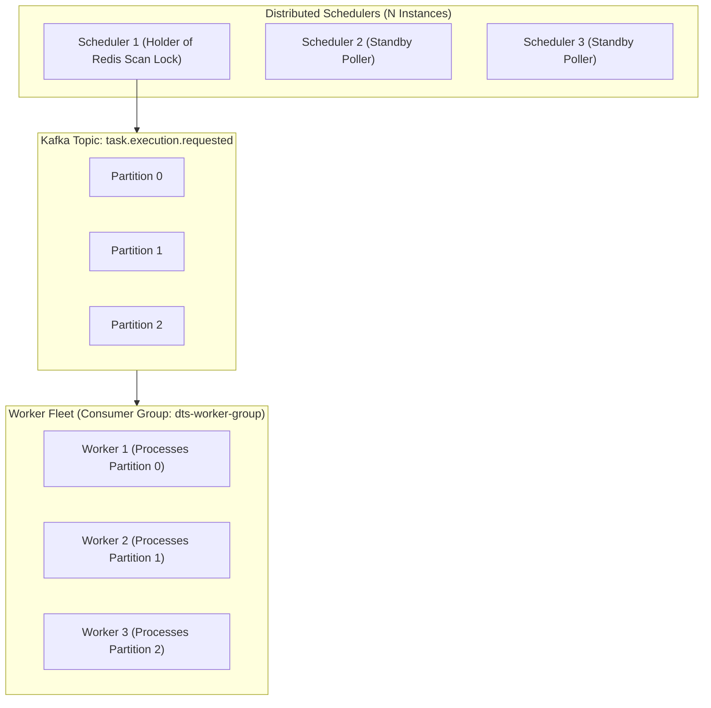

# Horizontal Scalability & Performance Engineering

---

## 1. Multi-Scheduler and Multi-Worker Scaling

The DTS platform is designed for linear horizontal scalability across all tiers:



### Running Multi-Node Scaled Clusters Locally
```bash
# Launch DTS with 3 workers and 3 schedulers simultaneously
docker compose up --scale backend=3
```

---

## 2. Why Horizontal Scaling Does Not Cause Duplicate Scheduling
1. **Coarse-Grained Redis Mutual Exclusion**:
   Every polling cycle, all scheduler nodes attempt to acquire the lock `lock:scheduler:poll`. Exactly one instance wins the lock; the remaining $(N-1)$ instances yield immediately.
2. **Fine-Grained PostgreSQL Row Partitioning**:
   The winning scheduler executes:
   ```sql
   SELECT * FROM tasks 
   WHERE status = 'ACTIVE' AND enabled = true AND next_run_at <= :now
   ORDER BY next_run_at ASC 
   LIMIT :batchSize
   FOR UPDATE SKIP LOCKED;
   ```
   Even if multiple threads execute the query concurrently, `SKIP LOCKED` guarantees that each thread receives a mutually exclusive set of task rows without locking conflicts or blocked connections.
3. **Partitioned Kafka Dispatch**:
   The scheduler partitions outgoing messages by `taskId`. All executions of a given task flow to the same Kafka partition, preserving sequential ordering when `FORBID_CONCURRENT` is enforced.
4. **Worker Parallelism**:
   Kafka consumer group rebalancing dynamically assigns partitions to active workers. If a worker fails or is terminated, Kafka automatically triggers a rebalance and assigns its partition to surviving worker nodes within seconds.
