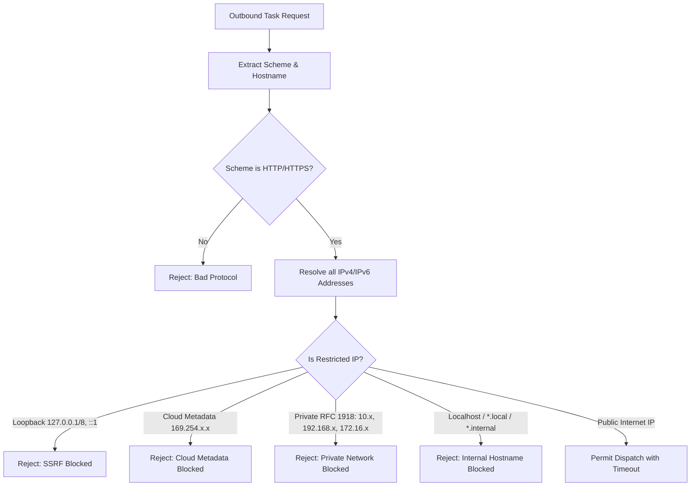

# Security Architecture & SSRF Hardening Specification

---

## 1. Authentication & Authorization Model
* **Password Hashing**: BCrypt with default work factor 10. Passwords are never stored or logged in plain text.
* **Token Architecture**: HMAC-SHA256 JWT tokens. Stateless validation with expiration (24h for access tokens, 7 days for refresh tokens).
* **Role-Based Authorization (RBAC)**:
  * `ROLE_USER`: Can create, view, pause, cancel, trigger, and inspect only their own tasks and executions.
  * `ROLE_ADMIN`: Global visibility across all users, cluster nodes, system telemetry, and audit logs.

---

## 2. Server-Side Request Forgery (SSRF) Protection

When users configure `HTTP_TASK` or `WEBHOOK_TASK` with an external URL, attackers may attempt to force the worker server to probe internal infrastructure, cloud metadata endpoints, or container localhost ports.

### 2.1 Mitigation Implementation in `SsrfValidator`
1. **Protocol Check**: Only `http` and `https` schemes are accepted (blocks `file://`, `ftp://`, `gopher://`).
2. **DNS Resolution**: `InetAddress.getAllByName(host)` resolves every IP bound to the hostname before opening connections.
3. **Restricted IP Checks**:
   * Loopback (`address.isLoopbackAddress()`)
   * Link-local / Cloud Metadata (`address.isLinkLocalAddress()` or `169.254.x.x`)
   * RFC 1918 Private networks (`address.isSiteLocalAddress()`)
   * Multicast addresses (`address.isMulticastAddress()`)
4. **Redirect Prohibition**: The HTTP client is explicitly configured with `followRedirects(HttpClient.Redirect.NEVER)` to prevent open-redirect SSRF bypasses.

---

## 3. Remote Code Execution (RCE) Defense
* Users cannot supply arbitrary Java code, Groovy scripts, or shell commands.
* `INTERNAL_TASK` jobs only accept predefined enum values (`SYSTEM_HEALTH_CHECK`, `MOCK_HEAVY_CALCULATION`, `MOCK_FAILURE_JOB`) implemented with static switch branches.
